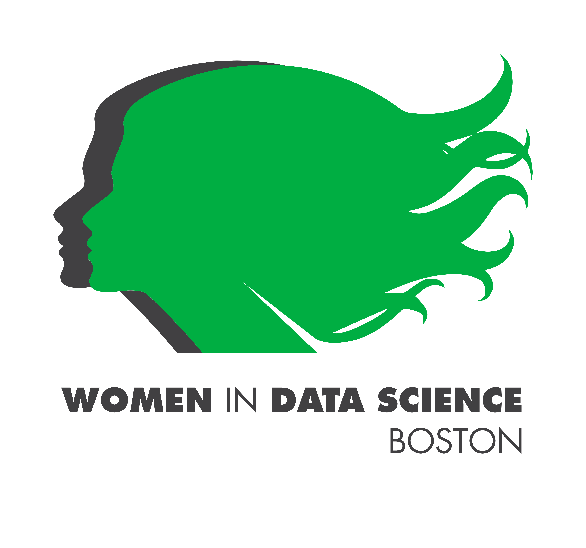
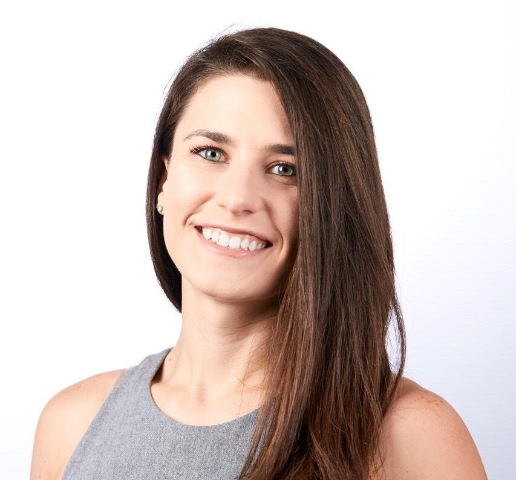
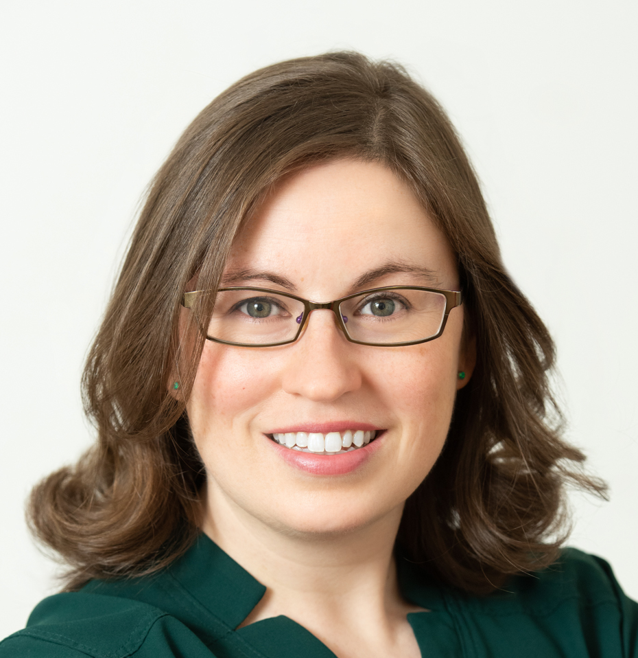

# WiDS Boston 2021

## Applications of Data Science

**April 29, 2021**

**12:00 pm - 1:30 pm ET**

**April 30, 2021**

**12:00 pm - 1:30 pm ET**

Please join us as we explore wide variety of applications of data science and highlight the work of exceptional women data scientists in this field.

This is a virtual event. Please register here.

## Agenda

The full agenda for this event is available [here](./agenda.Rmd)

**Speakers**

**Keynote Speaker: Monica Ramirez** *Community Science and Data Integration to Address Environmental Health Disparities* 

Mónica Ramírez-Andreotta is a community-engaged environmental health scientist and assistant professor of Environmental Science with joint appointments in the College of Public Health and Global Change-Graduate Interdisciplinary Program at the University of Arizona. Ramírez-Andreotta's laboratory uses an environmental justice framework to investigate the fate and transport of pollutants in environmental systems, exposure pathways, cultural models of communication, and methods to improve environmental health literacy. As such, she is often found listening to and training communities and hosting community gatherings and data sharing events. Ramírez-Andreotta is a playful, highly spirited individual who enjoys hanging with her boo, exercise, and democratizing science.

**Johanna Pingel** *Case studies of deep learning applications in Physics and Medical Imaging* 

Johanna Pingel is a Product Marketing Manager at MathWorks. She focuses on machine and deep learning applications and making AI practical, entertaining, and achievable. She joined the company in 2013, specializing in image processing and computer vision applications with MATLAB.

**Sirma Orguc** *A wavelet-based real-time facial recognition algorithm* 

Sirma Orguc is a postdoctoral associate at the Institute of Medical Engineering and Science at MIT. She received her M.S. in 2016, and Ph.D. in 2021 from Electrical Engineering and Computer Science Department at MIT. Her Ph.D. research focused on developing programmable interfaces for biomedical and neuroscience applications under the supervision of Prof. Anantha Chandrakasan and Prof. Polina Anikeeva. Her thesis presents an interdisciplinary approach to biomedical system design, at the intersection of electronics, algorithms, and material science. Currently, she is working on developing closed-loop hardware/software control systems for neuroscience applications with Prof. Emery Brown.

**Maura Walker** *Data Science to facilitate precision nutrition for disease prevention* 

Dr. Walker is a Research Assistant Professor in Department of Health Sciences with the Sargent College of Health and Rehabilitation Sciences at Boston University and Investigator of the Framingham Heart Study. She received an MS and PhD in Biochemical and Molecular Nutrition from Tufts University and completed a postdoctoral fellowship in Cardiovascular Epidemiology at Boston University School of Medicine. Her research focuses on characterizing the role diet quality in the life course progression of cardiometabolic diseases with the application of traditional and systems-level epidemiological approaches. The intent of her current research is to apply integrative-omics analyses (genomic transcriptomic, proteomic, metabolomic, and microbial biomarkers) that characterize intermediate phenotypes of dietary intake and may inform us about causal mechanisms linking diet and chronic disease.

**Sara S** *Using data science and analytics together for effective enterprise cyber security decision making.* 

She has developed underwriting models to predict mortality and automate risk class assignments, and actively contributes to Boston Data Science community. With over 10 years of experience in data science, Sara currently heads the Cybersecurity Analytics and Data Science team at MassMutual, where she and her team build data science and analytics solutions to help MassMutual lead the industry in cyber resilience and earn consumer trust.

**Elvira Osuna-Highley** *Applying machine learning to fluorescence microscope images* 

Dr. Elvira Osuna-Highley is a Senior Education Application Engineer at MathWorks. She partners with universities and scientific institutions to support teaching and research across various disciplines. Prior to joining MathWorks, Elvira was a Special Lecturer at Carnegie Mellon University in Computational Biology, a department in the School of Computer Science. Elvira earned a doctorate in Biomedical Engineering from Carnegie Mellon University where her research involved applying machine learning to fluorescence microscope images.

------------------------------------------------------------------------

#### Note About This Event

WiDS Boston is an independent event organized by Priyanka Gagneja and Neha Sardesai to coincide with the annual Women in Data Science (WiDS) Worldwide conference hosted by Stanford University and an estimated 150+ locations worldwide. All genders are invited to attend WiDS events, which feature outstanding women doing outstanding work.
